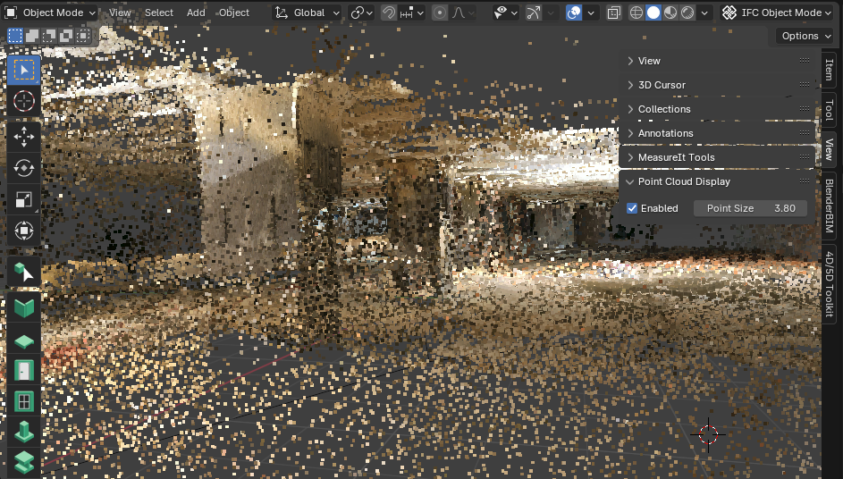

# Blender Point Cloud Display

A tiny blender plugin to display colored point clouds in the viewport. Allows you to preview data imported from PLY files,
or any other object with vertices that have a color attribute.

